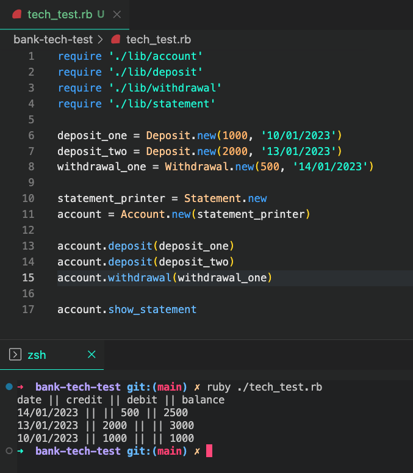
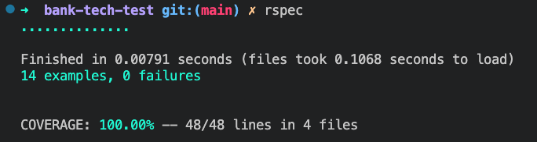

# Bank tech test

Week 10 of Makers Academy - practice take home tech test

The program can be run in IRB and allows a user to make deposits and withdrawals and also view a statement of transactions.


## Requirements

* You should be able to interact with your code via a REPL like IRB or Node.  (You don't need to implement a command line interface that takes input from STDIN.)
* Deposits, withdrawal.
* Account statement (date, amount, balance) printing.
* Data can be kept in memory (it doesn't need to be stored to a database or anything).

### Acceptance criteria

**Given** a client makes a deposit of 1000 on 10-01-2023  
**And** a deposit of 2000 on 13-01-2023  
**And** a withdrawal of 500 on 14-01-2023  
**When** she prints her bank statement  
**Then** she would see

```
date       || credit  || debit  || balance
14/01/2023 ||         || 500.00 || 2500.00
13/01/2023 || 2000.00 ||        || 3000.00
10/01/2023 || 1000.00 ||        || 1000.00
```

### User Stories

```
As a user
So that I can add money to my account
I would like to be able to make a deposit 

As a user
So that I can withdraw money from my account
I would like to be able to withdraw a specified amount 

As a user
So that I can keep track of my transactions
I would like to be able to print my bank statement showing deposits, withdrawls and dates

As a user
So that I know how much money I have
I would like my bank statement to show my balance after each transaction
```

## How to use 

This program was developed using Ruby v3.0.0 and can be run directly from the command line using IRB. To use the app, the following needs to be installed:

- ruby v3.0.0, installed using ```brew install ruby``` and ```rvm use 3.0.0```
- bundler, installed using ```gem install bundler```

After this, ensure that the repository is cloned to your local machine:
```
$ git clone https://github.com/aliceswood/bank-tech-test.git
$ cd bank-tech-test
```
### Run Program

In order to run the program in IRB, this will use the current date as default: 
```
$ irb
$ require './lib/account.rb'
$ require './lib/deposit.rb'
$ require './lib/withdrawal.rb'
$ require './lib/statement.rb'
$ 
$ account = Account.new(Statement.new)
$ 
$ account.deposit(Deposit.new(500))
$ account.deposit(Deposit.new(1000))
$ account.withdrawal(Withdrawal.new(400))
$ 
$ account.show_statement
```

### File Structure

- Account - handles the main logic of the transactions and the printing of the statement
- Deposit - creates a single deposit
- Withdrawal - creates a single withdrawal
- Statement - handles the formatting and creation of the statement

### Criteria Demonstration

To see the acceptance criteria being met:

```
ruby ./tech_test.rb
```



### Test Coverage

Test coverage is currently at 100% over all files. To run the tests:
```
rspec
```



## Approach and Reflection

My first step to approach the test was to fully read through and understand what is being asked in the outline given. I think that converting the criteria into user stories can really help with this step of the process.

I also used this time to create a brief diagram of what classes and methods I think might be needed and what each one might require and do. For this tech test, I decided that a good start would be to have the Account class, with 3 methods: deposit (to add funds), withdrawal (to remove funds), and show_statement (to keep track of these transactions). I decided that I would approach the task by getting the core functionality down before refactoring and extracting each method into a class of their own.


By creating the above plan, I was able to think through what I would want each of my methods to achieve and what they would need to do this. I initially expected 'deposit' and 'withdrawal' to have 1 argument each (the amount), but I soon realised that in order for the 'show_statement' method to have a date linked to a transaction. I would likely need to pass this as a second argument to the 'deposit' and 'withdrawal' methods. I decided that unless stated, I would have a default value of today's date.

Once I had the deposit and withdrawal methods test driven, the next step was to create the 'show_statement' function which included the current balance for all transactions up to that point. I was difficult at this point to get my head around how to format my test compared to my expected outcome of the method so this took some time to work through.

After acheiving the core functionality of the program, I wanted to extract the methods out into different classes to ensure that each class was reponsible for one aspect of functionality. My plan for predicted classes is below:


Therefore my next step was to build each of the individual classes and ensure that their dependencies were mocked so that I could pinpoint which class any errors were coming from. I created an integration test that tested each of the classes and the interaction with each other to ensure this was working as expected also.

### Areas to Improve

- I think that having the separation of classes from the start would have made development a bit more straight forward rather than extracting these at a later stage.

- The Deposit and Withdrawal classes could be combined into one Transactions class and this would have potentially streamlines some of the methods in Account as a result
